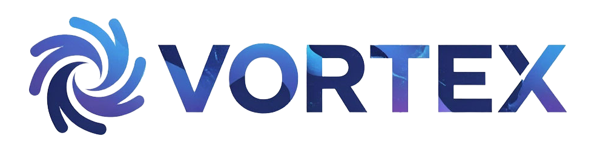

Социальная сеть для IT-сообщества. Пет-проект на Laravel 12, вдохновлённый Twitter/X, VK и Reddit.

## 📋 О проекте

Vortex — это полноценная социальная сеть с лентой постов, комментариями, лайками, подписками и профилями пользователей. Проект создан для изучения Laravel на реальном коде, а не на учебных примерах.

### Что уже реализовано

- **Аутентификация** — регистрация, вход, сброс пароля (Laravel Breeze)
- **Лента постов** — пагинация, адаптивная вёрстка
- **Создание постов** — Livewire + Alpine.js
- **Комментарии** — создание, редактирование, удаление (SoftDeletes), ответы (parent_id)
- **Лайки** — посты и комментарии (полиморфная связь), всплывайка с лайкнувшими
- **Профили пользователей** — аватар, обложка, био, статистика
- **Загрузка аватара** — Intervention Image (оригинал + thumb), cache busting
- **Подписки (Follow)** — Livewire-компонент с реактивными счётчиками
- **Роли** — Spatie Permission (`user`, `moderator`, `admin`)
- **Unit-тесты** — PHPUnit

### В планах

- Лента по подпискам
- Уведомления (Telegram, real-time)
- ElasticSearch для поиска
- Раздел «Карьера» с вакансиями от IT-комьюнити

## 🛠️ Технологии

| Слой | Технология |
|------|------------|
| **Backend** | PHP 8.2, Laravel 12 |
| **База данных** | PostgreSQL 15 |
| **Кеш / Очереди** | Redis |
| **Frontend** | Blade, Livewire 3, Alpine.js, Tailwind CSS |
| **Сборка** | Vite |
| **Изображения** | Intervention Image (GD) |
| **Роли** | Spatie Laravel Permission |
| **Тесты** | PHPUnit |
| **Инфраструктура** | Docker (nginx, php-fpm, postgres, pgadmin, redis) |

## 🚀 Запуск проекта

### Требования

- Docker и Docker Compose
- Node.js 18+ и npm
- Git

## Автор

Денис — [GitHub](https://github.com/DenisAmigo)

## Лицензия

[MIT](https://opensource.org/licenses/MIT)
